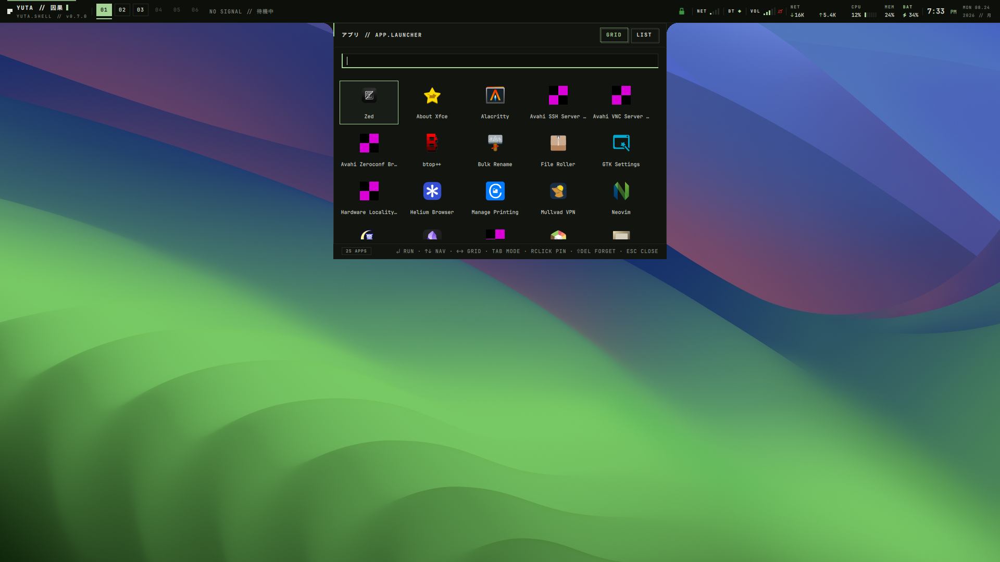
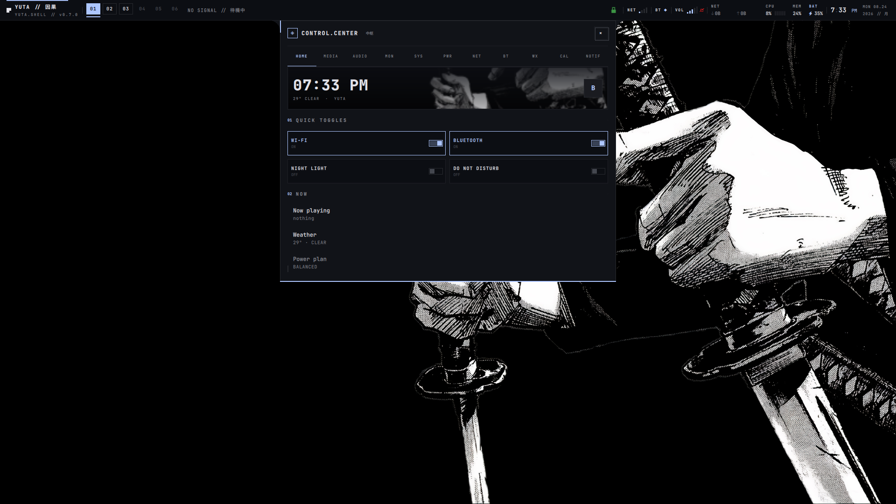
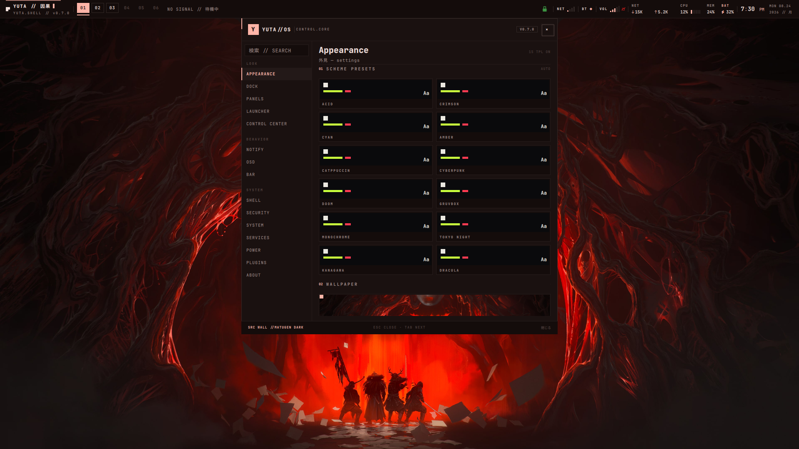
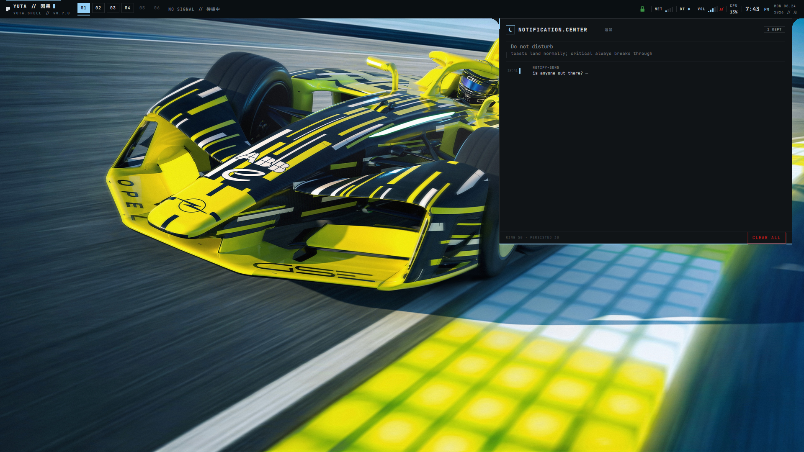
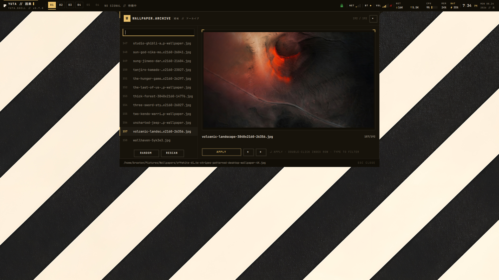

# YUTASHELL

A complete desktop shell for Wayland, built on [Quickshell](https://quickshell.outfoxxed.me).

Flat black surfaces, bone-white ink, a single acid accent, hairline structure, sparse Japanese micro-labels. Every color flows from one theme engine and every feature degrades gracefully when its backend is missing.

| | | |
|---|---|---|
|  |  |  |
| *desktop* | *app launcher* | *control center* |
|  |  |  |
| *settings* | *notification center* | *wallpaper archive* |

## Features

- **Bar** — 29 data-driven segments: workspaces, taskbar, tray, media ticker, stat blocks (CPU/GPU/mem/bat/disk/temp/fan), clock, mixer, scratchpad, chips, project profiles; reorder/toggle/zone-assign via drag-and-drop Kanban editor or IPC; battery wear, storage monitor, thermal thresholds integrated into control center; 7 built-in layout presets (Minimal, Classic, macOS, GNOME, Developer, Gaming, Ultra-minimal) with one-click apply; compact/full bar toggle; click profiles (Productivity, Media-First, Developer) with compound actions (IPC, shell commands, theme switching)
- **Theme engine** — 12 preset schemes, wallpaper-derived palettes via matugen, runtime light mode, any-hex accent override; the whole shell repaints live
- **Wallpapers** — archive UI with one-pick apply: paints the desktop and regenerates every enabled app template in a single pass (89 matugen templates across 10 groups, 17 snippet rules)
- **Launcher / command palette** — frecency-ranked search (launch count × time decay, pinned apps first, recents second), prefix modes: `=` calculator (recursive descent parser, no eval), `>` shell command runner, `@` notification history search, `#` color converter (#hex to rgb to hsl), `~` recent files browser (XDG recently-used.xbel)
- **Surfaces** — settings panel (17 pages), control center (11 tabs), app launcher (grid/list/detail), notification center, scratchpad manager, network/bluetooth/audio consoles, calendar, clipboard, weather, emoji picker, workspace overview (search + move windows), AltTab, power menu, lock screen, color picker, recording widget, updates checker, network details panel, process killer panel, thermal OSD, keybind cheatsheet; each spawns from the bar, a screen edge, or float, per panel
- **Notifications** — the shell *is* the notification daemon: themed toasts, inline actions, inline reply, DND + snooze, per-app rules, smart grouping & dedup, persisted history with search & replay
- **Connectivity & audio** — NetworkManager + BlueZ panels (pairing UX with pulsing border + cancel), network details panel (IP4/IP6, gateway, DNS, signal, link speed, MAC), PipeWire console with perceptual volume taper, per-app audio mixer (MixerPanel), OSDs, night light, brightness (internal + DDC/CI)
- **Workspace intelligence** — 5 workspace render modes (thumbnails/active/pills/numbers/default), scratchpad manager, window pin-to-all-workspaces, overview with search + move-between-workspaces, alt-tab, quick-tile
- **Session** — Wayland session lock (`WlSessionLock` + PAM auth, multi-monitor), hold-to-confirm power menu, caffeine idle-inhibit toggle, inhibitor-aware idle actions, power profiles, polkit dialog, pomodoro timer (work/break cycles with bar chip and notifications), night light schedule (auto on/off by time of day)
- **Plugins** — drop-in QML widgets for the bar and headless daemons
- **AI Desktop Agent** — Ollama/OpenAI-compatible chat via Process+curl with SSE streaming; two panels: Command Palette (natural language → parsed action with `[DISPATCH]`/`[SHELL]`/`[IPC]` directives, EXECUTE/COPY buttons) and Chat Sidebar (conversational bubbles, markdown rendering, model selector); context-aware system prompt built from live desktop state (focused window, workspace, stats, media, weather); voice input via pw-record+faster-whisper transcription; screenshot-to-action via grim+slurp region capture → Ollama vision model analysis; command history; kill button; boot probes endpoint availability and degrades cleanly
- **Project Profiles** — one-switch workspace contexts: save and restore bundles of wallpaper, apps, power profile, DND, bar layout, and night light; bar chip cycles profiles, YSurface picker for management; profiles persist across sessions in state.json
- **Automation Rules Engine** — declarative trigger-action rules ("when X happens, do Y"): 8 trigger types (time schedule, battery threshold, network, recording, temperature, focused app, media playback, idle), 8 action types (apply profile, power profile, DND, run command, notify, wallpaper, night light, bar preset); 30 s timer + event-driven signals with 60 s cooldown; YSurface rule editor with config chips and action builder; 8 starter rules (all disabled by default); bar chip shows ⚡ + enabled count
- **Developer Command Center** — unified dev surface with 6 tool tabs: git status (branch + dirty/staged/untracked counts, CWD from focused terminal), Docker Compose monitor (project cards with restart/stop), CI/CD pipeline status (GitHub Actions via `gh`, configurable repos, failure notifications), live log tailer (journalctl + hyprland + custom sources with regex filter), tmux/zellij dashboard (session list, attach/kill), port scanner (listening ports with exposed-port warnings); 3 bar segments (git, docker, cicd) with click-to-open
- **Focus & Wellness** — deep focus mode with Pomodoro-style work/break cycles: configurable durations (25/5/15 min defaults), DND + idle inhibit auto-enabled during focus, fullscreen break overlay with countdown + rotating health tips (9 prompts, 8s rotation), session stats logged to disk (30-day rolling window), YSurface panel with today/week/streak stats + 7-day history; bar segment shows ◉ countdown when focusing, "FOCUS" when idle; 4 configurable prefs in settings
- **Smart System Monitor** — battery intelligence (health/wear ring gauge, time remaining, charge threshold write for ThinkPad/Lenovo), network health (30s ping probes with latency grade, VPN status, IP/DNS display), power budget (top CPU apps with bar chart, screen brightness, discharge rate + estimated time), workspace memory heatmap (color-coded grid by window count, click to switch); unified YSurface panel with 4 tabs (BATTERY/NETWORK/POWER/WORKSPACES); bar segment shows ⚙ + battery % + latency
- **IPC** — 57 targets, 230+ functions; keybinds, CLI and settings panel share one implementation
- **Accessibility** — reduced motion mode (snaps all animations to instant), high contrast mode (maximum contrast palette), keyboard navigation (Tab/Shift+Tab focus cycling, Enter/Space activation, Escape to close panels)

## Requirements

| dependency | why |
|---|---|
| `quickshell` ≥ 0.3.1 | shell runtime |
| `hyprland` | compositor |
| `matugen` ≥ 4.x | theming pipeline |
| `awww` + `awww-daemon` | wallpaper painting |
| `grim` | screenshot capture |
| `slurp` | region selection |
| `wl-clipboard` | clipboard write |
| `cliphist` | clipboard history |
| `curl` | weather API, geolocation |
| JetBrainsMono Nerd Font | typeface |
| `noto-fonts-cjk` *(optional)* | Japanese labels (romaji fallback otherwise) |

Required backends (`grim`, `cliphist`, `wl-clipboard`) are probed at startup — missing ones hide their feature cleanly. Optional backends (`cava`, `hyprsunset`, `ddcutil`, `power-profiles-daemon`, `hyprpicker`, `gpu-screen-recorder`, `networkmanager`, `bluez`, `pipewire`) are also checked; if absent the related feature simply disappears.

## Installation

**Scripted (Arch, Debian, Fedora, openSUSE, Gentoo):**

```sh
git clone https://github.com/braxtonculver/yuta-qs
cd yuta-qs
make install    # checks deps, prints install commands, rsyncs to ~/.config/quickshell/yuta-qs
```

Re-run anytime to sync updates — your state in `~/.local/state/yutashell/` is never touched.

**Manual:** `git clone https://github.com/braxtonculver/yuta-qs ~/.config/quickshell/yuta-qs`
**Arch:** [`packaging/PKGBUILD`](packaging/PKGBUILD) · **Nix:** [`flake.nix`](flake.nix) (`programs.yutashell.enable`)

Then add to your Hyprland autostart:

```
exec-once = qs -c yuta-qs
```

## Keybinds

Everything user-facing is exposed over IPC — keybinds, CLI and the settings panel share one implementation:

```sh
qs ipc call <target> <function> [args...]
qs ipc call launcher toggle      # app launcher
qs ipc call wallpaper next       # cycle wallpaper + retheming pipeline
qs ipc call spawn set cc bottom  # control center docks to the bottom edge
```

Example hyprland keybinds:

```lua
_G.yuta = "qs -c yuta-qs ipc call"

hl.bind(mainMod .. " + SPACE",       hl.dsp.exec_cmd(yuta .. " launcher toggle"))
hl.bind(mainMod .. " + PERIOD",      hl.dsp.exec_cmd(yuta .. " cc toggle"))
hl.bind(mainMod .. " + L",           hl.dsp.exec_cmd(yuta .. " session lock"))
hl.bind("CTRL + SHIFT + I",         hl.dsp.exec_cmd(yuta .. " session idle-inhibit"))
hl.bind("ALT + Tab",                 hl.dsp.exec_cmd(yuta .. " overview alttab"))
```

Full command table → [docs/ipc.md](docs/ipc.md)

## Architecture at a glance

```
130 QML files · 52 singletons · 13 UI primitives · 57 IPC targets · 230+ functions
89 matugen templates · 17 snippet rules · 33 bar segments · 12 color schemes
7 layout presets · 17 settings pages · 11 control center tabs · 4 spawn modes
```

## Documentation

| doc | contents |
|---|---|
| [docs/ipc.md](docs/ipc.md) | complete IPC target/function reference, keybind examples |
| [docs/configuration.md](docs/configuration.md) | state files, theming contract, per-panel spawn origins |
| [docs/plugins.md](docs/plugins.md) | writing widgets, daemons & bar plugins |
| [docs/architecture.md](docs/architecture.md) | repo layout, development workflow |

Day-to-day configuration lives in the settings panel (`qs ipc call panel toggle`) — nothing needs hand-editing.

## License

[GPL-3.0-only](LICENSE)
