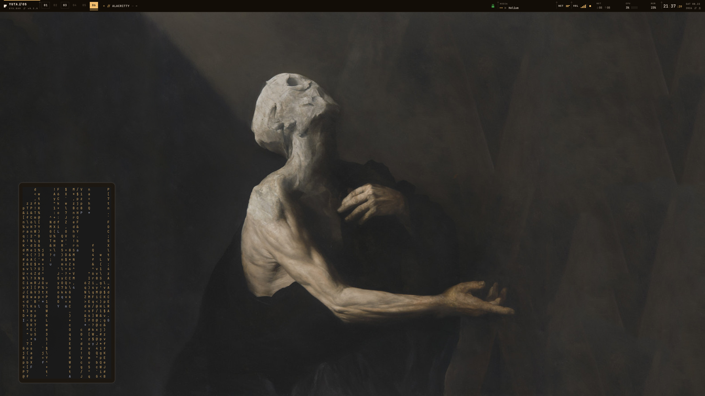
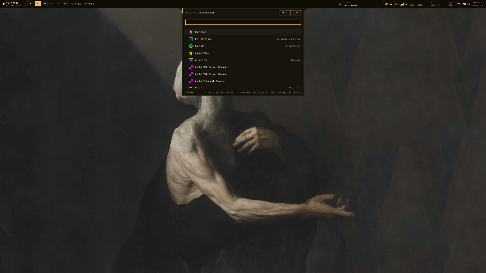
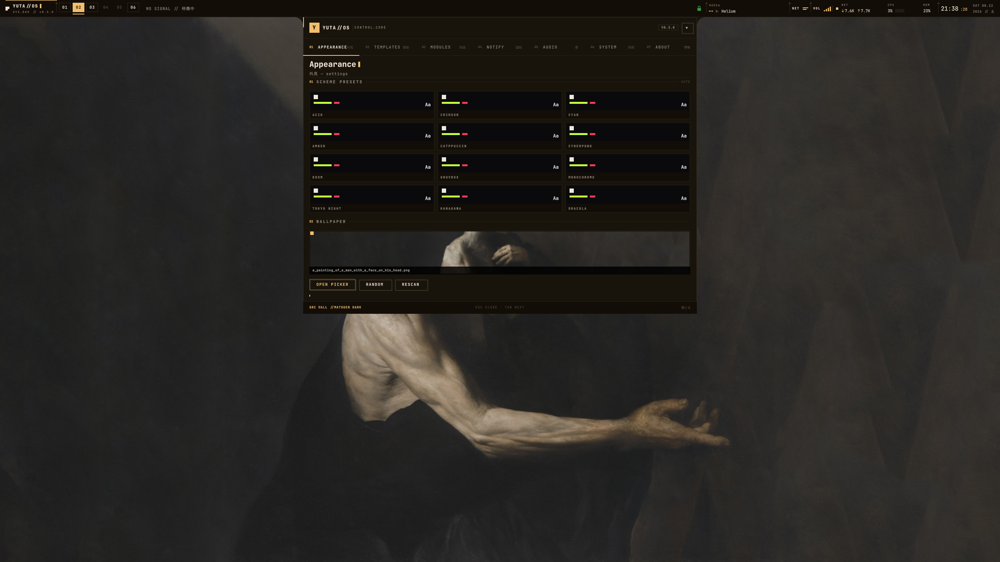
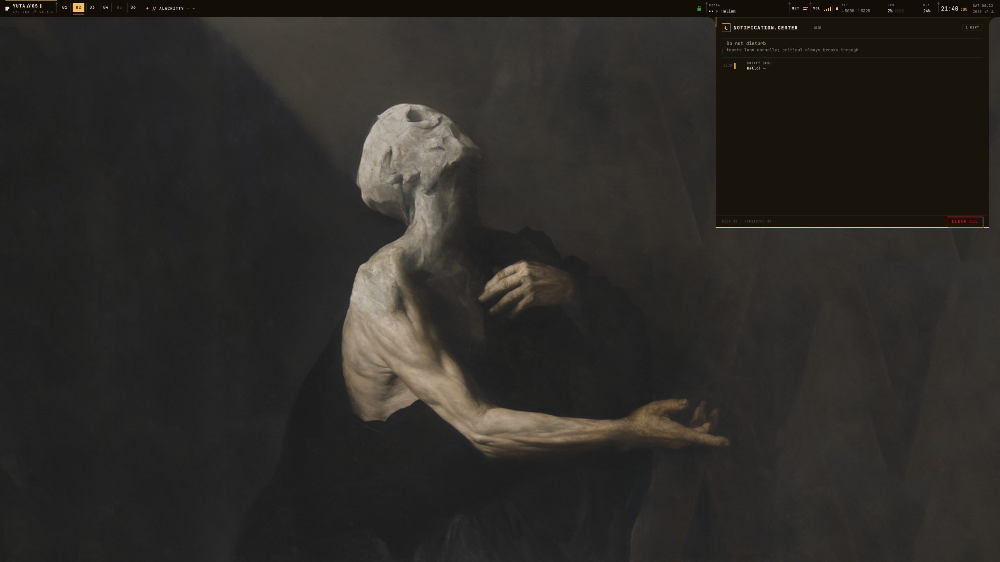
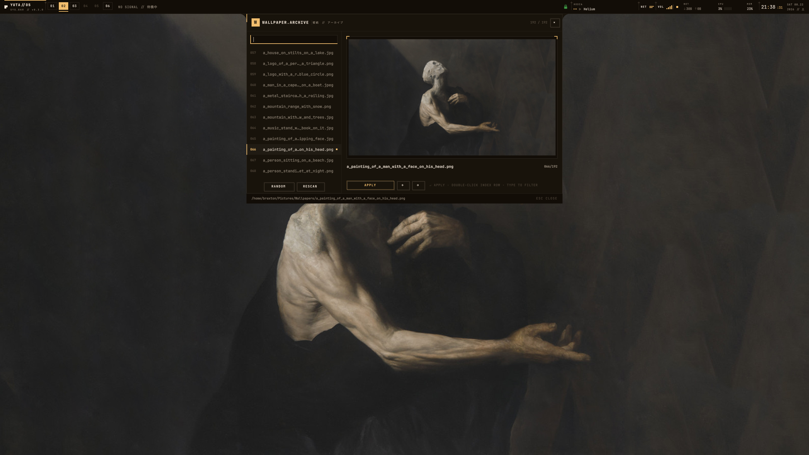

# YUTASHELL

A full desktop shell for Hyprland, built on [Quickshell](https://quickshell.outfoxxed.me).
Neo-brutalist Japanese cyber-minimalist: flat black surfaces, bone-white ink, one acid accent, hairline structure, uppercase mono type, sparse Japanese micro-labels. No rounded corners.

> **Status:** Phases 0–17 complete — the full roadmap: foundations, per-monitor taskbar, theme engine + matugen, settings control core, notification daemon, connectivity, audio/media/OSDs, session/lock/power, dock, overview, widgets, unified system data layer, configurable bar v2, control center, settings v4, and the final one-organism cohesion pass. The shell is a complete, polished daily driver.

## Showcase

| desktop | launcher | settings | notifications | wallpaper |
|---|---|---|---|---|
|  |  |  |  |  |

## Features (current)

- **Taskbar** (`modules/bar/`) — one bar window per connected screen, hot-plug aware
  - Identity block (`{HOSTNAME} // 因果` + `YUTA.SHELL // v{version}`) with blinking cursor, hover inversion; **left-click opens the settings panel**
  - **Configurable segments**: the whole bar is a data-driven organism — an ordered `{id, zone, enabled}` model in state.json (17 segments) resolved by `BarSegments`; the BAR settings tab toggles, zones and reorders them
  - Workspace switcher: dynamic slots, occupied/empty/urgent states, acid underline that slides to the focused workspace, red blink on window-urgent events
  - **Taskbar**: pinned + running apps merged (shares the dock's model), click launch/focus/minimize-cycle, middle-click new instance, right-click pin, scroll cycles windows
  - Focused-window title with app class, tracked via Hyprland's event stream
  - System tray (StatusNotifier): left-click menus, middle-click secondary actions, wheel scroll
  - Media segment: MPRIS now-playing ticker; net/bt/audio chips; per-segment click-actions (clock→calendar, stats→control center, …)
  - Stat cells: NET/CPU/MEM/BAT cluster plus toggleable CPU.TEMP / GPU / DISK.IO cells, all fed by SystemStats
  - Clock with blinking colon, seconds, weekday/date; kanji weekday when a CJK font is installed; bar scale 0.8–1.4× + top/bottom position
- **Theme engine** (`theme/`): every color/font/metric lives in one singleton. Twelve curated scheme presets (acid, crimson, cyan, amber, catppuccin, cyberpunk, doom, gruvbox, mono, tokyonight, kanagawa, dracula) plus wallpaper-driven palettes via matugen — regenerating a scheme repaints every open surface live. **Light mode** regenerates every palette at runtime (paper surfaces, ink text, contrast-fitted accents); an **accent override** lets any color take the acid slot. Japanese labels auto-degrade to romaji when no CJK font is present.
- **Wallpaper module** (`modules/common/Wallpaper.qml`): indexes `~/Pictures/Wallpapers`, paints through awww, feeds matugen, applies the generated palette to the whole shell
- **Matugen template registry**: per-app config theming (kitty, alacritty, fuzzel, hyprland, gtk3/gtk4, mako, dunst, starship, btop, rofi, or custom entries) regenerated on every wallpaper change. The shell detects which themed apps are actually installed (absent apps show ABSENT and refuse to enable), and for include-style configs it **writes the include line itself** into a managed `# >>> yutashell-matugen` block — toggling a template is zero-friction; disabling strips the block again. The Hyprland Lua variant (`hyprland-lua`) goes further: `colors.lua` applies window/group borders via Helmsman's `hl.config` at boot and a post hook re-applies them live after every regeneration — borders follow the wallpaper with no manual wiring.
- **Settings panel** (`modules/settings/`): drops from behind the bar as a large tabbed card — a **grouped nav rail** (LOOK / BEHAVIOR / SYSTEM) with 14 tabs and a **global search** field that filters the rail. APPEARANCE (schemes, mode/accent, matugen templates), DOCK, PANELS, LAUNCHER, CONTROL CENTER, NOTIFY, OSD, BAR (the segment framework), SHELL, SECURITY, SYSTEM, SERVICES, POWER, ABOUT; remembers your last visited tab
- **Wallpaper picker** (`modules/picker/`): the ARCHIVE, a centered rectangle a step larger than the launcher (~1000×600) — a numbered index spine on the left (pure type, no thumbnail decoding) and a huge framed preview stage on the right showing one wallpaper at full quality. The always-focused filter field drives everything: type to filter, arrows to walk the index, enter or APPLY to commit; random/rescan in the spine, current wallpaper marked with an acid dot. Picking runs the whole pipeline (paint → matugen → every enabled template → live recolor)
- **App launcher**: small centered card (~640×460) dropping from beneath the bar, indexing every installed `.desktop` entry — fuzzy search (subsequence + boundary scoring across name/id/generic-name/keywords), grid or list view, pinned apps + recents weighting (right-click to pin, shift-del forgets), desktop-action rows, an inline calculator row (click to copy), and a `:` command mode driving the shell's own functions (`:scheme cyan`, `:wall random`, `:dark`, `:panel`, …). Placement, width, view mode, pins and recents persist.
- **One surface at a time**: opening any popup (settings / launcher / picker / network / bluetooth / notification center) closes the others; every surface arrives with the house entrance ritual — drop from behind the bar with a soft socket landing, one acid scanline sweep, border burn, family tick draw — and leaves with the reverse ceremony (scanline returns up as the card lifts)
- **The machine is alive**: idle chrome breathes (the bar's acid strip pulses on a slow drift), every card carries a 2 px acid **power line** that draws itself on open, panel content cascades in as staggered rising rows, media plays through three swaying equalizer bars, net arrows flash acid under load, the BT glyph hunts while scanning, clock colons swell instead of strobe, switches wipe their fill and snap their knobs, rows interrogate on hover (wipe + growing status tick + detail crossfade), scroll rails fall asleep when idle, toasts stagger in and get a slide-up send-off — all opacity/transform-based and paused when hidden
- **Notification daemon** (`modules/notify/`): a full themed replacement for mako/dunst built on `Quickshell.Services.Notifications` — the shell *is* `org.freedesktop.Notifications`
  - Toast cards drop from behind the bar in a configurable corner (top-right/top-left), max N visible (1–6), flat black with a 1px urgency border (critical = alert red + CRITICAL tag), and a shrinking acid underline as the timeout progress; hovering a card pauses its countdown, criticals persist until dismissed
  - Inline action buttons rendered straight from each notification's actions; a global switch hides them all
  - **History ring**: every notification is recorded (50 in memory, 30 persisted to state.json) into the notification center — browsable card with per-row REPLAY / dismiss, CLEAR ALL, DND row with suppressed-counter chip
  - **Do not disturb**: IPC (`dnd on/off/toggle/status`) + bar-independent; normals/lows are held to history while criticals break through; a counter chip shows how many were silenced
  - Per-app overrides: match by app-name/desktop-entry substring → QUIET (history only) or BLOCK (drop entirely); edited in settings → NOTIFY tab along with default timeout, max visible, corner, and display-field toggles (app name / body / icon)
- **Connectivity suite** (`modules/net/`): native NetworkManager + BlueZ panels — no nm-applet
  - Bar segments: NET glyph with 4-tier wifi signal bars (or wired link bars, red × when wifi is off) and BT glyph when the adapter is powered; clicking opens their panels. Both toggleable in settings → MODULES
  - **Network panel**: wireless network list sorted by signal with lock glyphs + SAVED/CONN chips, inline passphrase join dialog (masked field), connect/forget for known networks, wired link speed + address, airplane mode master switch (wifi + BT radios down together), Wi-Fi radio/hard-block awareness
  - VPN tunnels: wireguard/vpn profiles listed from NetworkManager with UP/DOWN toggles
  - DNS: current resolvers readout + quick-set override applied to the active connection profile, REVERT back to DHCP
  - **Bluetooth panel**: adapter power/scanning/discoverable switches, device list with theme icons + battery % chips, PAIR / CONNECT / DISCONNECT / FORGET, and a trust switch (BlueZ trust doubles as the autoconnect flag)
- **Audio & media console** (`modules/audio/`): PipeWire through `Quickshell.Services.Pipewire`
  - Bar segment: output icon + four level bars (red slash when muted), wheel steps volume ±5 %, click opens the audio console, middle-click mute; toggleable in settings → MODULES
  - **Audio panel**: sinks and sources with per-device sliders (cubic taper so the travel feels linear), default-device star, per-app stream rows with individual volume + mute, master section with overdrive past 100 % up to a configurable ceiling (acid-flagged)
  - **OSD**: a brutal horizontal gauge stamps the corner on every volume/mic/brightness event — VOL/MIC/BRIGHT tag, big % readout, auto-fade; corner/width/fade persisted in settings → AUDIO
  - **Media widget**: MPRIS expanded — app glyph, track line, seekbar with elapsed/total, play/pause/next/prev transport
  - Night light (`hyprsunset`, temperature 1000–6500 K, IPC + bar chip while active) and DDC/CI brightness (`ddcutil`) both detect their binary at runtime and hide cleanly when absent
- **Session, power & lock** (`modules/session/`): power menu overlay with hold-to-confirm destructive tiles (lock/suspend/hibernate/reboot/poweroff/logout, tile set + order persisted), a full-screen lock screen on selected monitor(s) with PAM auth (`system-auth`) + wrong-attempt shake, inhibitor-aware idle timer (lock/suspend/shutdown, off by default), power plans via power-profiles-daemon (auto-detected), a themed Polkit privilege dialog, and a bar chip while any app holds the idle/sleep lock
- **Dock** (`modules/dock/`): optional bottom dock (OFF by default, enable in settings → DOCK) — pinned + running apps merged, active-window tick, click launch/focus/minimize-to-scratchpad cycle, middle-click new instance, scroll cycles an app's windows, right-click context menu (pin/close), intellihide (never/dodge/always), overlay vs exclusive edge, per-monitor instances
- **Overview** (`modules/overview/`): workspace grid (click to jump), an Alt-Tab style window switcher (MRU ordering, acid selection frame), scratchpad control (`special:magic`), and quick-tile presets (float/fullscreen/pseudo/center/left/right/top/bottom)
- **Widgets** (`modules/widgets/`): calendar popup (clock click, month grid + nav, shared `CalendarGrid` for the control center), weather (open-meteo, cached, conditions hero + 5-day strip), clipboard manager (cliphist history, search + re-copy + pin + wipe), screenshot suite (`shot region|full|window` with slurp styled in the live accent + shutter flash), update counter (`checkupdates`), screen-recording bar chip, color picker (hyprpicker, hides when absent), and an emoji/kaomoji picker — every widget degrades to a flat message when its backend is missing
- **Control center** (`modules/control/`): one themed popup falling from the bar with eleven lazy tabs — HOME (quick toggles + glance rows), MEDIA, AUDIO, MONITORS, SYSTEM (live sparklines), POWER, NETWORK, BLUETOOTH, WEATHER, CALENDAR, NOTIFICATIONS; anchor configurable, tab set/order persisted
- **System data layer** (`modules/common/SystemStats.qml`): one sampling engine (CPU per-core, memory, network, disk IO, load, uptime, hwmon temps, nvidia-smi GPU, battery) with FAST/SLOW poll classes and threshold signals — the bar stats and control-center graphs all drink from it
- **UI kit** (`modules/common/ui/`): YButton / YSwitch / YRow / YSection / YField / YChip / YSlider / YScroll / YSurface / YPulse / YClickAway / FastWheel — every panel is composed from these plus Theme tokens only, so all surfaces read as one system
- **Surface language**: the bar sits on the overlay layer (topmost); every popup slides out from behind it on a shared choreography (`movSlow` drop, eased exit). **Clicking outside any popup closes it** (a fullscreen click-catcher behind the card) and never dims the desktop; ESC closes, and only one surface is open at a time
- **Error surface**: optional-backend absences (hyprsunset/ddcutil/cliphist/hyprpicker/…) report to a `Health` singleton; the bar shows a `!` chip with a tooltip instead of failing silently

## Requirements

- Arch Linux (or similar), Hyprland
- `quickshell` >= 0.3.1
- Fonts: `JetBrainsMono Nerd Font` (required), `noto-fonts-cjk` (recommended — enables the Japanese micro-labels):

  ```
  sudo pacman -S --needed ttf-jetbrains-mono-nerd noto-fonts-cjk
  ```

- Optional (needed for wallpaper theming): `matugen`, `awww` — used by the scheme engine:

  ```
  sudo pacman -S --needed matugen awww
  ```

- Optional feature backends (each degrades gracefully if absent — the shell hides the surface instead of crashing):
  - `grim`, `slurp`, `wl-clipboard`, `cliphist` — screenshot + clipboard (future phases)
  - `hyprsunset` — night light
  - `ddcutil` — external monitor brightness (DDC/CI)
  - `power-profiles-daemon` — power plans
  - `papirus-folders` — papirus icon theming (needs a passwordless sudoers drop-in for its post hook)

## Run

```
quickshell -p ~/.config/quickshell/yuta-qs
```

Or set it as your session shell by launching that command from your Hyprland/Helmsman autostart (this machine runs it as `qs -c yuta-qs`).

There's also a bootstrap script — `./install.sh` prints the dependency matrix and can install missing packages (`--install`) and symlink the repo into place (`--link`).

## Keybinds & IPC

Every user-facing action is exposed over Quickshell's IPC, so keybinds, CLI, and the settings panel all drive the same functions. The general form is:

```
qs ipc call <target> <function> [args...]
```

| target | function | what it does |
|---|---|---|
| `launcher` | `toggle` / `open` / `close` | app launcher overlay (fuzzy search, `:` commands, calc) |
| `panel` | `toggle` / `open` / `close` | settings drawer |
| `picker` | `toggle` / `open` / `close` | standalone wallpaper picker panel |
| `scheme` | `set <name>` | apply a preset — see `scheme list` for all 12 ids |
| `scheme` | `list` | print available preset ids |
| `scheme` | `wallpaper` | re-follow the last applied wallpaper's palette |
| `wallpaper` | `set <path>` | set + paint + regenerate palette for an image |
| `wallpaper` | `next` | cycle to the next indexed wallpaper |
| `wallpaper` | `random` | jump to a random indexed wallpaper |
| `wallpaper` | `list` | print every indexed wallpaper path |
| `theme` | `generate <image>` | same as `wallpaper set` (explicit alias) |
| `theme` | `dark on\|off\|toggle` | light/dark mode — light palettes are regenerated live from the active scheme or wallpaper |
| `theme` | `accent <#hex\|none>` | override the acid accent (persisted; `none` follows the scheme again) |
| `templates` | `list` | show template catalog with enabled state |
| `templates` | `on <id>` / `off <id>` | enable/disable a template (rewrites matugen.toml, injects/strips app-config snippet, re-applies; refuses absent apps) |
| `templates` | `add <id> <input> <output>` | register a custom matugen template |
| `templates` | `remove <id>` | remove one |
| `dnd` | `on` / `off` / `toggle` | do-not-disturb: normals/lows held to history, criticals break through |
| `dnd` | `status` | print dnd state + suppressed count + history size |
| `notifycenter` | `toggle` / `open` / `close` | notification history center |
| `notifycenter` | `clear` | dismiss all live toasts + wipe history |
| `notifycenter` | `test <urgency>` | send a test toast (`normal`/`low`/`critical`) |
| `network` | `toggle` / `open` / `close` | network panel (wifi/wired/vpn/dns) |
| `bluetooth` | `toggle` / `open` / `close` | bluetooth panel |
| `audio` | `open` / `close` | audio console (devices, streams, mic) |
| `audio` | `volup` / `voldown` | master volume ±5 % with OSD |
| `audio` | `mute` / `micmute` | toggle output / input mute (OSD variant per kind) |
| `audio` | `status` | print sink name + volume + mute state |
| `audio` | `nl` / `nltemp <K>` | night light toggle / set temperature (hyprsunset; hides when absent) |
| `display` | `bright <0-100>` | external monitor brightness over DDC/CI (ddcutil; hides when absent) |
| `session` | `toggle` / `open` / `close` | power menu overlay (hold-to-confirm tiles) |
| `session` | `lock` | engage the lock screen (PAM auth) |
| `session` | `logout` / `suspend` / `hibernate` / `reboot` / `poweroff` | end-session actions (logout flushes state first) |
| `session` | `profile <saver\|balanced\|performance\|cycle>` | set/cycle power profile (power-profiles-daemon) |
| `session` | `idle <none\|lock\|suspend\|shutdown> <secs>` | idle action + timeout (off by default) |
| `session` | `status` | lock state, inhibitors, profile, idle config |
| `notify` | `show <app> <summary> <body>` | post a toast through the shell daemon (for scripts/Helmsman) |
| `dock` | `toggle` / `enable` / `disable` | master switch for the bottom dock (OFF by default) |
| `dock` | `pin <id>` / `unpin <id>` | pin/unpin an app by desktop-entry id |
| `dock` | `hide <never\|dodge\|always>` | intellihide mode |
| `dock` | `mode <overlay\|exclusive>` | float overlay vs reserve a bottom strip |
| `dock` | `status` | enabled state, mode, hide mode, pin count |
| `overview` | `toggle` / `open` / `close` | workspace overview grid |
| `overview` | `alttab` | open/advance the window switcher (ALT+Tab) |
| `overview` | `scratchpad` / `scratchsend` | toggle `special:magic` / send focused window to it |
| `overview` | `tile <float\|fullscreen\|pseudo\|center\|left\|right\|top\|bottom>` | quick-tile the focused window |
| `overview` | `status` | window + workspace counts |
| `calendar` | `toggle` / `open` / `close` | calendar popup (also bound to the bar clock click) |
| `clipboard` | `toggle` / `open` / `close` / `status` | cliphist history manager |
| `weather` | `toggle` / `open` / `close` / `refresh` / `status` | weather panel |
| `weather` | `set <lat> <lon> <label>` | configure the location (open-meteo) |
| `shot` | `region` / `full` / `window` | screenshot (grim/slurp, saved to the configured dir) |
| `shot` | `copy` / `dir` | re-copy the last shot / print save config |
| `updates` | `check` / `list` / `open` / `status` | pacman update counter (pacman-contrib) |
| `recording` | `stop` / `status` | stop gpu-screen-recorder / query its state |
| `colorpicker` | `pick` | grab a screen color (hyprpicker; hides when absent) |
| `emoji` | `toggle` / `open` / `close` | emoji / kaomoji picker |
| `cc` | `toggle` / `open` / `close` | control center |
| `bar` | `seg <id> on\|off\|left\|center\|right` | enable/disable or re-zone a bar segment |
| `bar` | `move <id> up\|down` | reorder a segment within its zone |
| `bar` | `scale <0.8-1.4>` / `position <top\|bottom>` | bar size + edge |
| `bar` | `click <id> <action>` / `status` | set a segment's click-action / print bar state |

### Hyprland binds (standard setup)

Add to your `hyprland.conf` (or Helmsman equivalent):

```
bind = SUPER, A, exec, qs ipc call launcher toggle
bind = SUPER, S, exec, qs ipc call panel toggle
bind = SUPER, W, exec, qs ipc call wallpaper next
bind = SUPERSHIFT, W, exec, qs ipc call picker toggle
bind = SUPERSHIFT, C, exec, qs ipc call scheme set crimson
bind = SUPER, N, exec, qs ipc call notifycenter toggle
bind = SUPERSHIFT, N, exec, qs ipc call dnd toggle
bind = SUPER, G, exec, qs ipc call network toggle
bind = SUPER, B, exec, qs ipc call bluetooth toggle
bindl = , XF86AudioRaiseVolume, exec, qs ipc call audio volup
bindl = , XF86AudioLowerVolume, exec, qs ipc call audio voldown
bindl = , XF86AudioMute, exec, qs ipc call audio mute
bindl = , XF86AudioMicMute, exec, qs ipc call audio micmute
```

If your config wraps dispatches in a dispatcher layer (e.g. this machine's Helmsman Lua dispatcher), route the command through that layer's exec wrapper instead — the shell side is plain `exec`, no special dispatch strings needed.

## Project structure

```
yutashell/
├── shell.qml                  # entry point + per-screen Variants + IpcHandlers
├── theme/
│   ├── qmldir                 # singleton registration
│   ├── Theme.qml              # design tokens + scheme engine + contrast check
│   ├── schemes/               # static preset palettes (12 schemes)
│   └── matugen/               # our own template + vendored catalog → theme.json
├── modules/
│   ├── bar/                   # taskbar: identity, workspaces, active window,
│   │                          # tray, media ticker, stats, clock + ui/
│   ├── common/
│   │   ├── ShellState.qml     # runtime state + persisted prefs singleton
│   │   ├── TemplateCatalog.qml# vendored matugen-themes registry
│   │   ├── Wallpaper.qml      # index/apply pipeline, template registry
│   │   └── ui/                # YButton/YSwitch/YRow/YSection/YField/YChip/YScroll
│   ├── picker/                # standalone wallpaper picker + ui/
│   ├── launcher/              # app launcher overlay (AppLauncher + fuzzy.js)
│   ├── notify/                # notification daemon: Notify singleton,
│   │                          # toast stack, history center + ui/
│   ├── net/                   # connectivity: NetBlock/BtBlock bar segments,
│   │                          # NetworkPanel, BluetoothPanel
│   ├── audio/                 # PH.07: AudioService (Pipewire), AudioBlock bar
│   │                          # segment, audio console, MediaWidget, OSDs,
│   │                          # NightLight (hyprsunset), DisplayService (ddcutil)
│   ├── session/               # PH.08: power menu, lock screen (PAM), idle,
│   │                          # power profiles, polkit agent dialog
│   ├── dock/                  # PH.09: bottom dock (Dock logic + DockBar)
│   ├── overview/              # PH.10: workspace grid, alt-tab, scratchpad,
│   │                          # quick-tile presets
│   ├── widgets/               # PH.11: calendar, clipboard, weather, screenshot,
│   │                          # emoji, updates, recording, color picker
│   └── settings/              # control-core drawer + ui/
```

## Environment notes

This shell is tuned to this machine's setup; two quirks are load-bearing:

1. **Helmsman Lua dispatcher.** This system's Hyprland wraps all IPC dispatches in Lua, so plain dispatch strings like `workspace 3` fail. All compositor actions go through wrapper functions using Lua-form dispatches, e.g. `Workspaces.switchTo(id)` sends `hl.dsp.focus({ workspace = "N" })`. If you ever remove Helmsman, change those wrappers back to standard dispatch strings.
2. **`Hyprland.activeToplevel` stays null** on this Quickshell build, so the focused-window title is derived from `activewindow` / `activewindowv2` raw events plus a one-shot `hyprctl -j activewindow` query at startup.

## Files written at runtime

Everything the shell writes lives under `~/.local/state/yutashell/`:

| file | purpose |
|---|---|
| `state.json` | persisted prefs: active scheme, wallpaper path, follow-wallpaper, dark mode, accent override, bar segment toggles, template registry, launcher (mode/anchor/width/pins/recents), settings panel (placement/width/last page), notifications, audio/OSD, session/lock/idle/hold, dock (enabled/mode/hide/monitors/pins) |
| `theme.json` | matugen output for the shell's own palette (watched, live-reloads) |
| `matugen.toml` | generated matugen config assembled from the template registry |
| `snippet.stage` | transient staging file used to move managed config snippets into app configs |

## Theming contract

Modules never hardcode colors. Everything reads from the `Theme` singleton so the matugen pipeline only rewrites token values. The `acid` preset baseline:

| token | value | role |
|---|---|---|
| `bg` | `#0a0a0c` | surfaces |
| `ink` | `#eae8e0` | primary text |
| `acid` | `#c8ff3d` | accent |
| `alert` | `#ff3b52` | urgent/destructive |

Twelve curated scheme presets (`acid`, `crimson`, `cyan`, `amber`, `catppuccin`, `cyberpunk`, `doom`, `gruvbox`, `mono`, `tokyonight`, `kanagawa`, `dracula`) plus wallpaper-driven palettes from matugen; light mode is regenerated at runtime from any palette. An accent override can swap the acid slot for any hex.

## Roadmap

The full phased build plan — launcher, notifications, WiFi/BT panels, audio/media OSDs, dock, lock screen, settings core, matugen theming, control center, and the PH.16 settings suite — lives in [ROADMAP.md](ROADMAP.md). Phases 0–10 are complete; 11+ are next.

Licensed under [CC BY-NC-SA 4.0](https://creativecommons.org/licenses/by-nc-sa/4.0/)
